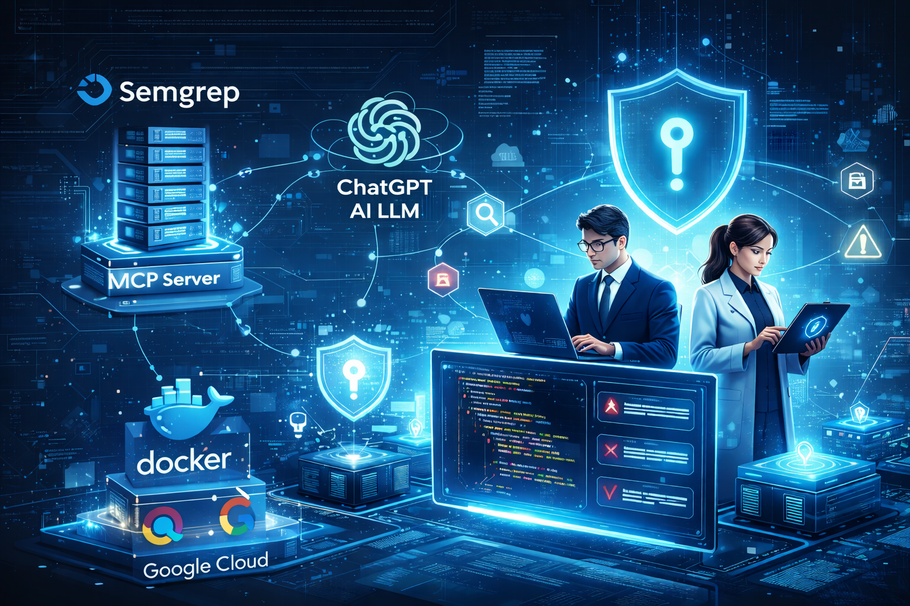

# Cyber Security Analyzer

An AI security analysis platform for Python codebases that combines deterministic static analysis with agent-based reasoning. This project is deployed as a containerized, serverless application on Google Cloud Run and is intended to demonstrate practical AI engineering, cloud-native design, and application security concepts.

GCP Deployment Link: https://cyber-analyzer-lrti6ew3yq-uc.a.run.app/

Upload the file `testing_code.py` to the analyse the code.

---

## Project Overview

Cybersecurity Analyzer scans Python projects for potential security issues using **Semgrep** (a pattern-based static analysis tool) and enhances those findings with contextual reasoning from a large language model.

Rather than treating AI as a standalone scanner, the system integrates it as a reasoning layer on top of structured security signals. This results in clearer findings, reduced noise, and more useful explanations compared to traditional static analysis alone.

---

## System Architecture

The application is organized into clear frontend and backend responsibilities, designed for containerized deployment.

### Frontend

- Built with **Next.js** (React) and **TypeScript**
- Styled using **Tailwind CSS**
- Provides:
  - An interface for submitting code for analysis
  - A clear presentation of detected security issues
  - Human-readable explanations of findings
- Located in the `frontend/` directory

The frontend focuses on usability and clarity rather than raw scan output.

---

### Backend

- Built with **FastAPI** (Python)
- Located in the `backend/` directory
- Acts as the orchestration layer that:
  - Receives analysis requests
  - Coordinates security scanning
  - Communicates with the AI agent
  - Returns normalized, structured results

The backend is packaged as a Docker container and deployed to Google Cloud Run.

---

## Security Analysis Design

The analysis pipeline is intentionally layered to balance precision and coverage.

### Static Analysis Layer

- Uses **Semgrep**
- Performs deterministic pattern matching against Python code
- Identifies potential security issues quickly and consistently

This layer prioritizes recall, ensuring that relevant patterns are not missed.

---

### Agent-Based Reasoning Layer

- Uses the **OpenAI Agents SDK**
- Integrates with Semgrep through the **Model Context Protocol (MCP)**

Instead of embedding static scan results directly into prompts, Semgrep is exposed as an MCP server. This allows the AI agent to:
- Request specific scans when needed
- Pull structured results on demand
- Reason about findings using surrounding context

This design reduces false positives and produces clearer explanations for reviewers.

---

## Deployment and Infrastructure

### Containerization

- The application is packaged as a Docker image
- The container includes the backend and its analysis dependencies
- This ensures consistency between development and production environments

---

### Google Cloud Run

- Deployed on **Google Cloud Run**, a fully managed serverless container platform
- Key characteristics:
  - Automatic scaling based on traffic
  - Stateless execution
  - Scale-to-zero when idle for cost efficiency

Environment configuration (API keys and service settings) is handled through Cloud Run’s managed configuration.

---

### Infrastructure as Code

- Infrastructure definitions are managed using **Terraform**
- Covers:
  - Cloud Run services
  - IAM permissions
  - Supporting cloud resources

This enables reproducible, auditable deployments and reflects production-grade DevOps practices.

---

## Key Concepts Explained

**Static Application Security Testing (SAST)**  
Analysis of source code for security issues without executing the application.

**OWASP**  
The *Open Web Application Security Project*, a nonprofit organization that publishes widely used security guidance and vulnerability categories.

**Semgrep**  
A fast, syntax-aware static analysis tool that detects issues using rule-based patterns.

**Model Context Protocol (MCP)**  
A standardized interface that allows language models to interact with external tools (such as Semgrep) in a structured, tool-aware manner.

---

## Why This Project Matters

This project demonstrates how modern AI systems can be integrated responsibly into security workflows:

- AI is used to **enhance**, not replace, deterministic tooling
- The system is designed for real deployment, not experimentation only
- Architecture choices reflect scalability, maintainability, and cost awareness
- Security findings are presented in a way that developers can act on

---

## Skills Demonstrated

- AI Engineering: agent-based workflows and tool-integrated reasoning
- Cloud Engineering: serverless container deployment on Google Cloud Run
- DevSecOps: static analysis, containerization, and infrastructure as code
- Backend Engineering: FastAPI-based orchestration and API design
- Application Security: practical SAST concepts and vulnerability analysis
# Cyber-Security-Analyzer
